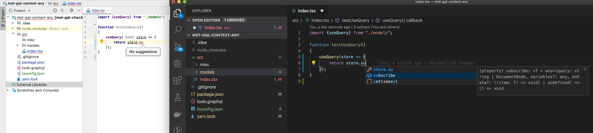

# Reproduce bug

```
yarn
```

Then check `src/index.tsx`. The line with `store.` is expected to suggest functions like `query`, `subscribe`, etc.

VisualStudioCode (Version: 1.40.2) does autocompletion/suggestion while IntelliJ 
(IntelliJ IDEA 2019.3 (Ultimate Edition) Build #IU-193.5233.102, built on November 27, 2019) doesn't:


